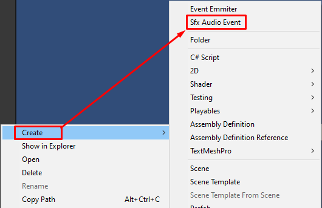
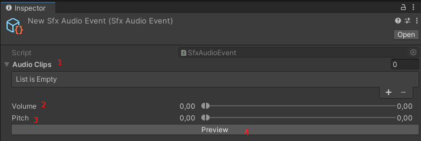
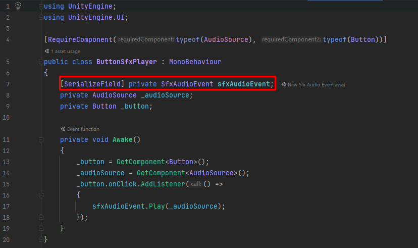

# Gattai Tools - Documentação

## Glossário

| **Índice** | **Classe** |
   |---|---|
| 1 | SfxAudioEvent |  

## **1. SfxAudioEvent**

### 1.1 Resumo
SfxAudioEvent, uma classe que herda de Audio Event e pode ser usada para configuração avançada de efeitos sonoros, com múltiplos áudios, range de volume e ecos que são aleatórios, e é possível testar o resultado diretamente no modo editor com o clique do botão "Preview".

### 1.2 Como utilizar
**1. Crie um SfxAudioEvent no menu Create > SfxAudioEvent**

**2. Configure o SfxAudioEvent**

>Legenda:
> 
>1 = Lista de áudios do SfxAudioEvent que serão tocados aleatoriamente.
>
>2 = Range de volume. O som irá variar de volume de acordo com esse Range.
>
>3 = Range de eco. O som irá variar de eco de acordo com esse Range.
>
>4 = Clique no botão para testar o SfxAudioEvent.

**3. Crie uma classe com um campo do tipo SfxAudioEvent. Veja o exemplo da classe ButtonSfxPlayer:**

>Observação:
> 
>No exemplo da classe acima, o SfxAudioEvent será tocado ao clicar em um botão. 

### 1.3 Referência
https://youtu.be/6vmRwLYWNRo?t=2144